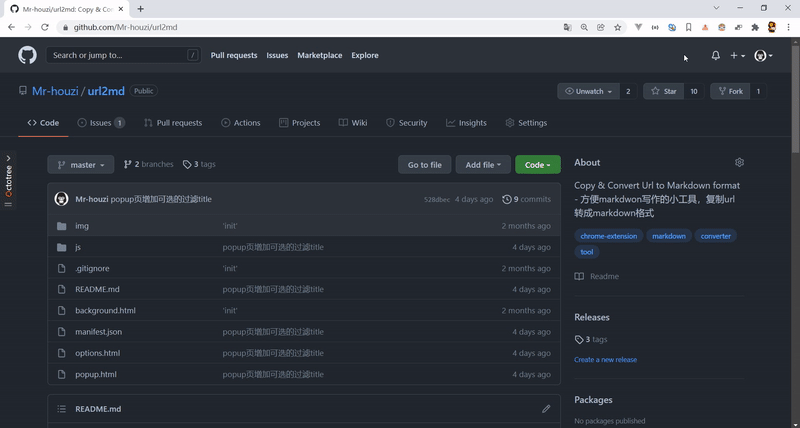

# url2md

<p >
    <a href="">
        
    </a>
    <a href="">
        
    </a>
    <!-- <a href="">
        
    </a> -->
    <a href="">
        
    </a>
    <a href="">
        
    </a>
    <a href="">
        
    </a>
</p >

方便 markdwon 快速写作的小工具，复制 url 转成 markdown 格式的 chrome 插件。

## 如何安装

[chrome web store](https://chrome.google.com/webstore/detail/url2md/ecdciemleflfmjghiimgklihlfimhocm)

or

[releases download](https://github.com/Mr-houzi/url2md/releases)

在 chrome `扩展程序` -> `开发者模式` -> `加载已解压的扩展程序`，选中项目的根目录，即可安装成功。

## 功能

### 右键菜单使用

操作简单到只有一个操作，那就是在 chrome 中使用鼠标右键菜单选择 `复制url转成markdown格式`


1.若是网页空白处进行的操作，将会提取本网页地址生成 markdown 格式的 url。

```text
[Chrome插件(扩展)开发全攻略 - 我是小茗同学 - 博客园](https://www.cnblogs.com/liuxianan/p/chrome-plugin-develop.html)
```
 
2.若是在一张图片之上进行的操作，将会提取图片地址生成 markdown 格式的 url。

```text

```

3.在选中链接上的文字，然后右键操作，将会提取超链接和文字转成 markdown 格式的 url。

```text
[Google's New Logo](https://www.google.com/doodles/googles-new-logo)
```

### 点击 icon 使用

点击 icon 可以选择过滤后的多种 title，该方式使用会帮你过滤掉一些网站“不太优雅的小尾巴”。

```text
// origin
[(35 条消息) 有哪有优秀的golang库？ - 知乎](https://www.zhihu.com/question/63974075/answer/2268869183)

// transform
[有哪有优秀的golang库？ - 知乎](https://www.zhihu.com/question/63974075/answer/2268869183)
[有哪有优秀的golang库？](https://www.zhihu.com/question/63974075/answer/2268869183)
```



### url 设置

- 保留Unicode字符（默认）
- Unicode字符将被编码

```text
// 保留Unicode字符（默认）
[三体III：死神永生 - 维基百科，自由的百科全书](https://zh.wikipedia.org/wiki/三体III：死神永生)

//Unicode字符将被编码
[三体III：死神永生 - 维基百科，自由的百科全书](https://zh.wikipedia.org/wiki/%E4%B8%89%E4%BD%93III%EF%BC%9A%E6%AD%BB%E7%A5%9E%E6%B0%B8%E7%94%9F)
```

## 如何升级

1.watch 本仓库，当有新版本发布时会收到 Github 推送的邮件。

2.在项目目录下拉取更新。

```
git pull
// or
git pull origin v1.0.1
```
3.在 chrome `扩展程序`中找到`url2md`板块，点击重新加载代码按钮。

## 感谢

icon 来自[Ant Design 官方图标库](https://www.iconfont.cn/collections/detail?spm=a313x.7781069.1998910419.dc64b3430&cid=9402)

## License

本项目基于 [MIT license](https://opensource.org/licenses/MIT).
