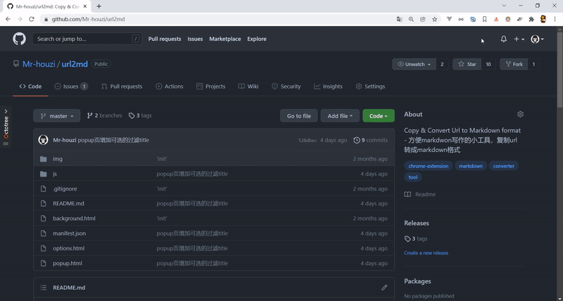

# url2md

<p >
    <a href="">
        
    </a>
    <a href="">
        
    </a>
    <!-- <a href="">
        
    </a> -->
    <a href="">
        
    </a>
    <a href="">
        
    </a>
    <a href="">
        
    </a>
</p >

English | [简体中文](./README.md)

A small tool for convenient markdown writing. It is a Chrome extension that converts copied URLs to markdown format.

## How to Install

[Chrome Web Store](https://chrome.google.com/webstore/detail/url2md/ecdciemleflfmjghiimgklihlfimhocm)

or

[Download from Releases](https://github.com/Mr-houzi/url2md/releases)

In Chrome, go to `Extensions` -> `Developer mode` -> `Load unpacked extension`, and select the root directory of the project to install it successfully.

## Features

### Using Right-Click Menu

The operation is as simple as right-clicking on a webpage and selecting "Copy URL as Markdown Format" from the context menu.


1. If you perform the operation on a blank space of a webpage, it will extract the URL of the current page and generate the markdown format.

```text
[JavaScript console methods: A deep dive. - DEV Community](https://dev.to/kelvinguchu/javascript-console-methods-a-deep-dive-jbf)
```

2. If you perform the operation on an image, it will extract the image URL and generate the markdown format.

```text

```

3. If you select text within a hyperlink and then right-click, it will extract the hyperlink and text as markdown format.

```text
[Google's New Logo](https://www.google.com/doodles/googles-new-logo)
```

### Using Icon Click

Clicking the icon allows you to select from multiple filtered titles. This method helps filter out some "less elegant" tails of websites.

```text
// Original
[(35 messages) What are some excellent Golang libraries? - xxx](https://www.xxx.com/question/63974075/answer/2268869183)

// Transformed
[What are some excellent Golang libraries? - xxx](https://www.xxx.com/question/63974075/answer/2268869183)
[What are some excellent Golang libraries?](https://www.xxx.com/question/63974075/answer/2268869183)
```



### URL Settings

- Preserve Unicode characters (default)
- Encode Unicode characters

```text
// Preserve Unicode characters (default)
[三体III：死神永生 - 维基百科，自由的百科全书](https://zh.wikipedia.org/wiki/三体III：死神永生)

// Encode Unicode characters
[三体III：死神永生 - 维基百科，自由的百科全书](https://zh.wikipedia.org/wiki/%E4%B8%89%E4%BD%93III%EF%BC%9A%E6%AD%BB%E7%A5%9E%E6%B0%B8%E7%94%9F)
```

## Acknowledgements

The icon is from the [Ant Design Official Icon Library](https://www.iconfont.cn/collections/detail?spm=a313x.7781069.1998910419.dc64b3430&cid=9402).

## License

This project is licensed under the [MIT license](https://opensource.org/licenses/MIT).

PS: *This document was translated by ChatGPT and manually proofread.*